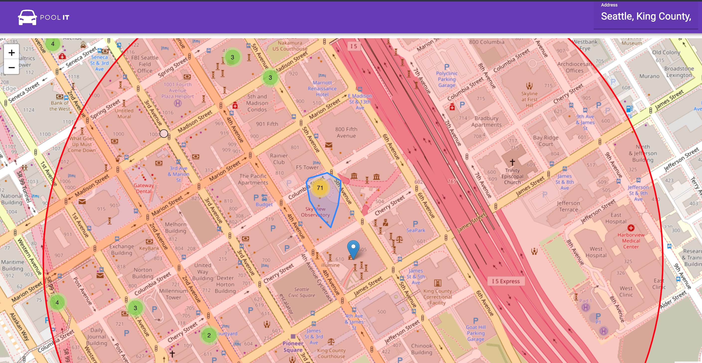
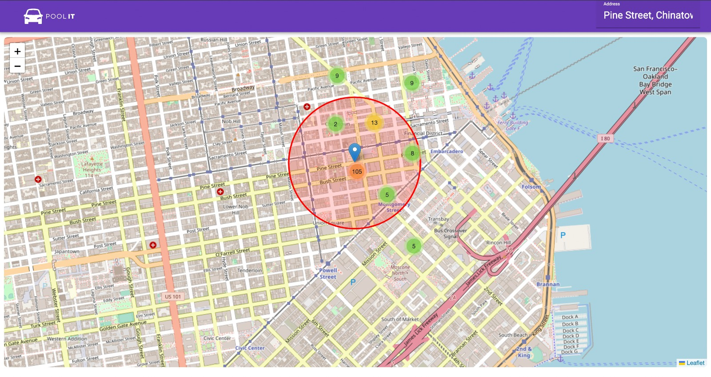

# Pool IT

Pool IT! If you drive to work on a regular basis, sign up to find passengers and
enjoy the benefits of HOV or express lanes, share the costs of driving, and enjoy the
company. If you don’t like driving, want to limit your driving, or don’t have a car, sign up to
find a driver. Carpool matching works when there is a balance between commuters who
want to ride and who want to drive.

## Inspiration

In the past, Many taxi companies have spent around $250 billion on optimizing the solution for carpooling. The massively profitable industry is pushing them towards improving the constraint of carpooling services. By understanding the use cases of the people we were able to implement the solution which solves 3 important problems: time, efficiency, and less harm to the environment. Also helping nearby people who want to reach the same place in less amount of time. When we were confronted with this idea, our team noted its potential for a business point where they can have a count of people over the nearby place and disburse the required amount of cars according to the need. That way leading towards the end goal and allowing to get optimized for the individual users. This information could even help businesses decide which place to deploy more amount of cars in such a way that many people will be able to reach their destination at their particular requested time.

## What it does

After receiving the address of a location as input, the program returns local trip information within the standard radius of 500 feet collected from the INRIX Trade Trip API over some time. Within that radius, we could find the number of source nodes compared to other source nodes moving toward the same destination. It combines the number of persons going towards the same destination leading to a grouping cluster. This way they will be able to get a carpool to reach towards destination within the time requested.

## How we built it

We used technologies such as Typescript, Angular, Node.js, Google API, INRIX (trade- Area Trips ) API, and leaflet.js. This API offers a collection of nearly every trip that INRIX records. For all of these trips, it documents the start time, end time, start location, end location, distance, average speed, and data credibility of each. These data points are incredibly valuable, especially when formatted in a user-friendly way. We used a mathematical formula to compute the shortest distance between two source entities (K-means algorithm) and determine their final position trough by comparing their endpoints.

The "Trade Area Trips" API is what powers the entire application. This API provides access to almost all of the trips that INRIX records. It records the start time, end time, starting location, finishing location, distance, average speed, and data reliability for each of these journeys. These facts are immensely useful, especially when presented in an approachable fashion. We analyze and present this data on a color-coded map to make it palatable for the general public. Angular was used to create the front-end website that shows the map, and Node.js was used to create the back end that processes the data from INRIX's API. The Leaflet package and Chart.js are both used in the frontend web application to display our data on a map.

## Challenges we ran into

Since most of us had no prior experience with restricted APIs, we first had trouble obtaining authentication tokens for the INRIX API. But thanks to our hackathon mentors and the INRIX documentation, we were able to dynamically update our tokens in the end. The grid of squares on our map presented another set of difficulties because we had to account for the Earth's curvature. We solved this using a set of equations that precisely translated latitude and longitude information to miles.

## Accomplishments that we're proud of

The plot we were able to produce is something we are quite proud of. The user-important data is displayed clearly and understandably on the interactive map. We were quite proud that we were able to present our data on an interactive map, which was something we had hoped to accomplish. We are quite proud of the practical application of the offered INRIX API, which goes along with our visualization. To clarify, the majority of the crew had zero knowledge of APIs before beginning the project. We were able to overcome our lack of knowledge and produce a useful project thanks to the training and mentoring. We take satisfaction in our newfound understanding of how APIs are used.

## What we learned

Some team members had never used Typescript before this event, yet they were nevertheless able to pick it up quickly and contribute to the final output. Our team had a fantastic opportunity to gain practical skills by getting first-hand exposure to API requests. Additionally, we were able to gain knowledge of many of the open-source JavaScript libraries and APIs, which helped us advance the project as a whole. The truly effective programmer needs to be aware of the libraries and APIs available to him or her while developing a project because starting from scratch is a difficult undertaking.

## What's next for Pool IT

Many of the features that were added after the initial capability of showing pertinent customer trip data were realized showed how the team views this as a constantly changing product. Given that the INRIX API is designed to collect data, PoolIt can handle larger data sets if they are made available. Our objective is to give businesses as much pertinent information as we can. We anticipate that further features will be added, such as the option for users to export the data for analysis with their tools and the presentation of person group trends across the data to explain consumer travel patterns. Additionally, we think that using this tool for longer periods could yield even more beneficial insight.

## Authors

-   [Jagadeesh Marali](https://github.com/jagadeeshmarali)
-   [Nisarg Bhalavat](https://github.com/bhalavat-nisarg)
-   [Vaibhav Sachdeva](https://github.com/Vaibhav-Sachdeva)
-   [Abhishek Praveenkumar](https://github.com/ABHISHEK22415)
-   [Dhruv Desai](https://github.com/Dhruv590)
